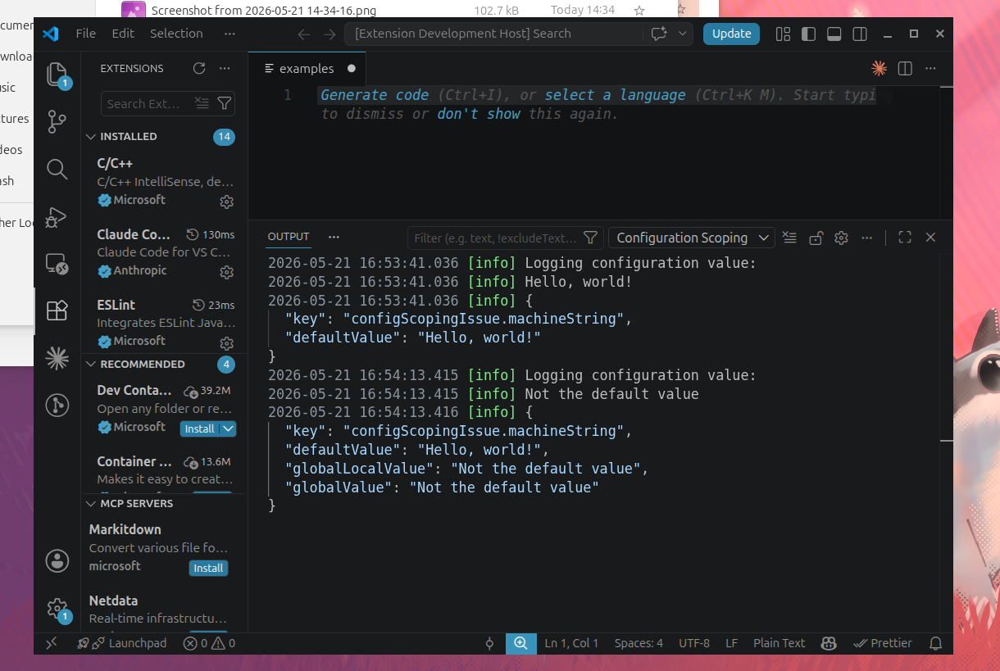
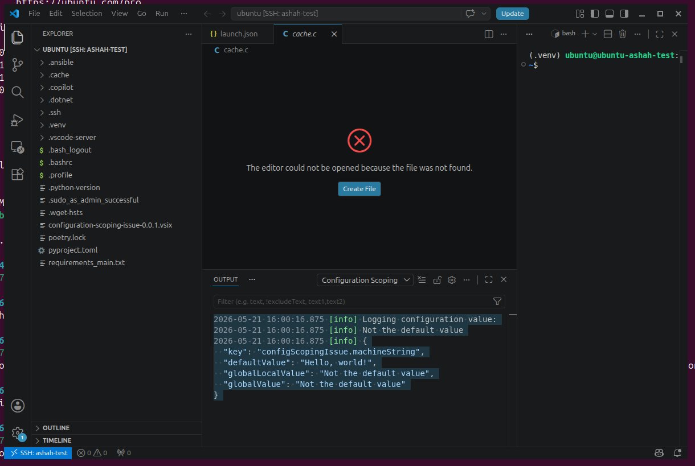

# Demo repository illustrating scoping issues with machine scoped VS Code configuration

## Steps to Reproduce

1. Make this extension with `npm install`, `npm run package`
2. Install the extension locally, and set the configuration variable from the configuration settings (CTRL+comma). Note that configuration.get returns the value that you have set.
  
3. Install the extension on a remote machine. **On activation, note that the value you have set on the local machine appears in the configuration.get log line. I would expect the default value to be returned here, because the local configuration should not be returned to the remote machine**. This bug is probably because `globalValue` is set in configuration.inspect.
  
